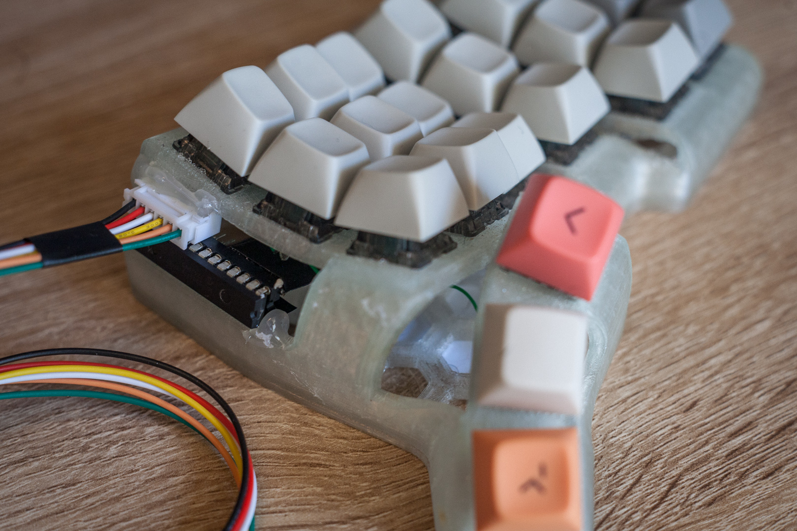

# Dual MCP23017 and RP2040 Split Keyboard
A split keyboard using a pair of MCP23017 I/O Expanders, one per half, that communicate with a central RP2040 board, in my case a Raspberry Pi Pico. 

It would have made more sense to connect the columns and rows of each half directly to the central part using 10-pin cables (e.g. IDC 2x5), but I didn't have any on hand, while I *did* have the MCPs laying around gathering dust, as well as plenty of JST-XH 6-pin cables and connectors.

## MCP23017 and JST-XH 6 pin Connector
The MCP23017 needs 4 pins to connect to the RP2040 board: VDD, VSS, SCL, and SDA. Luckily for us, they are all conveniently placed next to each other from pins 9 to 13 (source [Microchip datasheet (pdf)](https://ww1.microchip.com/downloads/aemDocuments/documents/APID/ProductDocuments/DataSheets/MCP23017-Data-Sheet-DS20001952.pdf)). 

The pitch on the socket is also the same as a JST-XH connector (2.54mm), so we can just line it up with 90 degree JST-XH connector and solder the pins directly. Opposite from the power/I2C pins, are 4 more pins that we need to wire up. 

Reset (18) needs to be connected to VDD. The address pins need to be connected to either VDD or VSS. How you wire them will affect the address it uses on the I2C bus (see page 15 of the datasheet). In the photo above, A2 is connected to VDD, while A0 and A1 are connected to VSS. This equals an address of `0b00100100`, or `0x24`. It goes without saying that each half should use a different address.

The pins for the switches can then be wired to the data pins (GPA0 to 7, GPB0 to GBP7) in any configuration you wish. In the photo above, I've wired the rows to GPA0 through to GPA3. The columns were then wired from GPB0 to GPB5. 

Once the wires are soldered (I used 30AWG single-core wrapping wire), I use insulation tape to prevent them from touching each other. Heat-shrink tubes might be an option, but I didn't have any small enough.

## Keyboard Shell
For the keyboard shell I used the [Bastard Keyboard's TBK Mini](https://bastardkb.com/tbk-mini/), which I had 3D printed locally. The expander and connector fit perfectly in the opening on the inside of the halves, but they still need hot glue to hold them in place.

## Central RP2040
For the central board I used a Raspberry Pi Pico, but any board that runs CircuitPython/KMK should work. To connect everything together, I used a 2x8cm protoboard (6x28 holes, 2.54mm pitch), again, conveniently lying around.

One JST-XH connector for each keyboard half, and 6 standard 90 degree header pins to connect to the Pico. Only 4 of the pins are used, but I left all 6 in because it helps them stay in place while soldering.

You'll also notice the two resistors. When using I2C on the Pico, you'll need external pull-up resistors as apparently the Pico doesn't have any internal ones when using I2C lines (?). These go between SCL and VDD, and SDA and VDD.

The order of the pins is constrained by the IC socket/connector assembly. Start from the expander side, then work your way to the bridge, keeping in mind that the connectors are rotated on the PCB plane and not mirrored, and wire the matching pins accordingly. 

While the order of the header pins doesn't matter, it is convenient to line up VDD with the ends of the resistors and the JST connector which has VDD closest to the header pins.

Once everything is wired up, I wrapped the remainder of the protoboard in insulation tape, then attached the Pico. I used some more tape to hold it in place horizontally, then used hot glue to make it stay put.

## Wiring complete
For safety, I covered the bridge and Pico in an anti-static bag to prevent any accidental shorts while moving it around on my desk.

## Software
See the readme for the [MCP23017 Scanner](../../kmk/scanners/mcp23017.md) I wrote.

# Notes
- Test early and test often.
- Before wiring everything up to a keyboard, put the IC socket on a breadboard, wire it up to a Pico "normally" using header pins, and make sure all the basic/sample/example code works, and that you can get a switch (or a short using header wires) to make the Pico to print something to the console.
- Double check your pin order, especially when turning components upside down.
- Don't forget the pull-up resistors if your board needs them.
- Once everything is working, you'll want to increase the I2C frequency from the default 100Hz to 400Hz (`frequency=400000` in your keymap).
- Make sure to set the correct `offset` for your RHS split.
- Make sure to set the correct `coord_mapping` in your keymap.

# References
- [MCP23017 - Microchip Technology](https://www.microchip.com/en-us/product/mcp23017)
- [Raspberry Pi Pico Datasheet](https://datasheets.raspberrypi.com/pico/getting-started-with-pico.pdf)